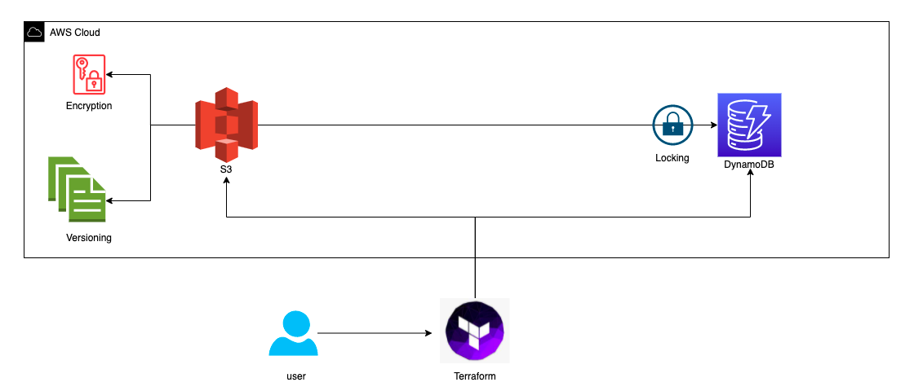

# REMOTE STATE
By default, Terraform stores state locally in a file named `terraform.tfstate`. When working with Terraform in a team, use of a local file makes Terraform usage complicated because each user must make sure they always have the lastest state data before running Terraform and make sure that nobody else runs Terraform at the same time.

With ***remote*** state, Terraform writes the state data to a remote data store, which can then be shared between all members of a team. Remote state storage is a critical component of Terraform’s recommended best practices for managing infrastructure as code, especially in collaborative, multi-user or multi-environment scenarios.

Storing the Terraform state remotely offers several advantages:

- **CONCURRENCY CONTROL**: Remote state storage provides a locking mechanism that prevents multiple users or processes from making conflicting changes to the same infrastructure simultaneously. This helps maintain data consistency and integrity.
- **COLLABORATION**: In team environments, remote state storage enables collaboration on infrastructure projects. Multiple team members can work together on the same infrastructure without conflicts.
- **DISASTER RECOVERY**: Local state files are susceptible to loss of corruption. Remote state storage offers a more robust approach to disaster recovery, ensuring that state data remains safe and recoverable.
- **CONSISTENCY**: Remote state storage ensures that all team members are working with the same, up-to-date state information. This prevents configuration drift and confusion caused by divergent states.
- **VERSIONING**: Many remote state backends offer versioning, allowing us to track changes to the state over time. This can be crucial for auditing and troubleshooting.
- **REMOTE STATE BACKENDS**: Terraform supports a variety of remote state backends, including cloud object storage services (e.g. AWS S3, Azure Blob Storage), databases (e.g. Hashicorp Consul, etcd) and other storage solutions.

